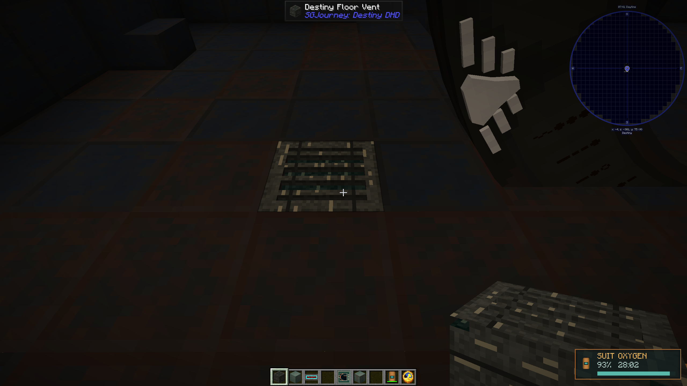

# SGJourney: Destiny DHD

SGJourney: Destiny DHD is a Forge 1.20.1 addon for **Stargate Journey** that recreates Destiny's dialing systems, shipboard effects, handheld controller, and Kino probes from *Stargate Universe*.

Use this documentation to install the addon, build and operate the Destiny equipment, dial seven- and nine-symbol addresses, deploy a Kino, view its live feed, and configure the mod for a multiplayer server.

## Start here

- [Installation](getting-started/installation.md)
- [Quick start](getting-started/quick-start.md)
- [Destiny gate system](guides/destiny-gate.md)
- [Handheld controller](guides/handheld.md)
- [Kino operation](guides/kino.md)
- [Controls & how-to](controls.md)
- [Crafting recipes](recipes.md)
- [Configuration](configuration.md)
- [Troubleshooting](troubleshooting.md)

{: .note }
Crafting recipes are documented here, but JEI is recommended in-game because it reflects recipes from the exact installed version.
